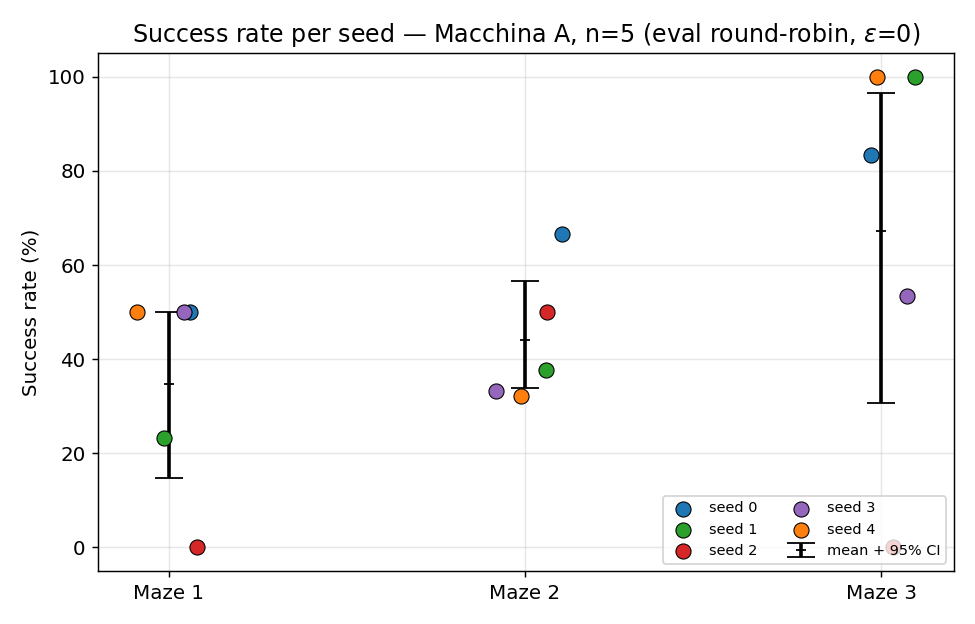
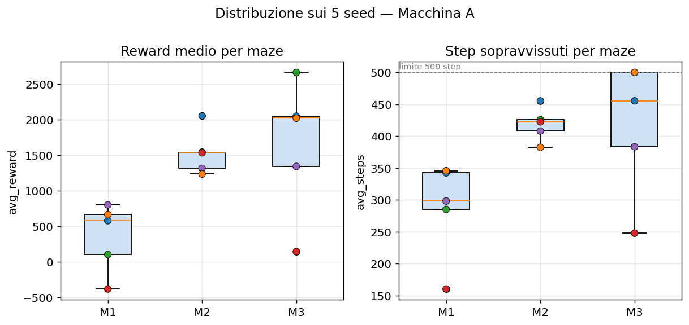
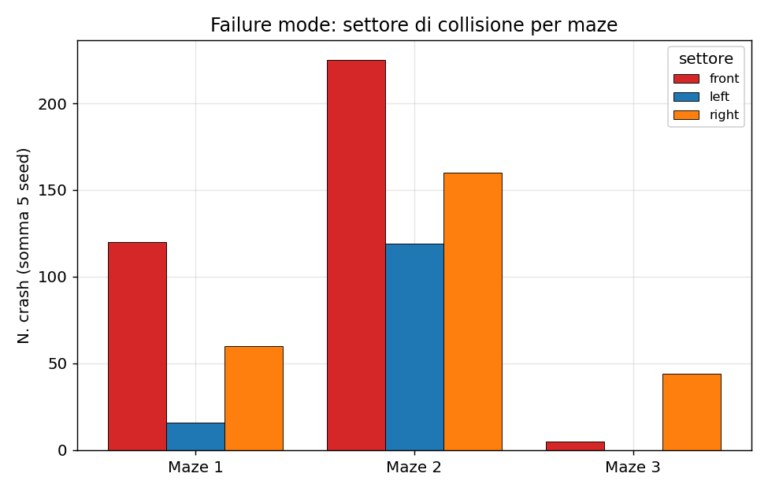
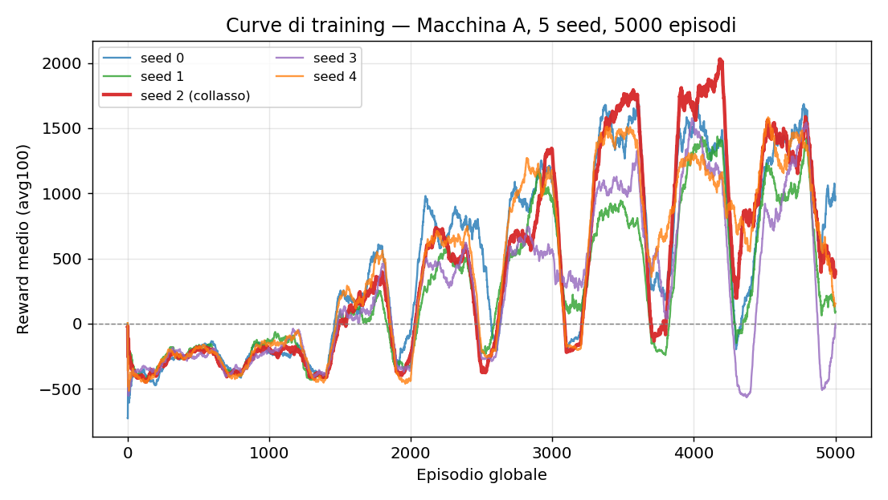

# Report — Studio di riproducibilità a 5 seed (Macchina A)

**Config:** `r_alpha` · **Macchina A** (singolo host) · **5 seed** (0–4) · **5000 episodi** di training ciascuno · valutazione greedy (ε = 0).
**Data:** 2026-05-25 · **Versione informale (IT).** Per la versione paper-style in inglese vedi [`report_en.md`](report_en.md).

> **Nota sull'anonimizzazione.** L'hardware è indicato come "Macchina A". La parte cross-hardware (Macchina A vs Macchina B) è ancora **preliminare** (n = 1 per macchina) ed è riportata solo come osservazione + rimando al documento dedicato [`PAPER_ANALYSIS/riproducibilita_seed_hardware.md`](../PAPER_ANALYSIS/riproducibilita_seed_hardware.md).

---

## 1. In due righe

Cinque training identici per codice e iperparametri, che differiscono **solo per il seed**, danno risultati **molto diversi** in valutazione. Su Maze 3 il comportamento è **bimodale**: due seed riescono al 100%, uno fallisce allo 0%. La media (67%) da sola **nasconde** questa instabilità. Conclusione operativa: un singolo run non è informativo; servono distribuzioni su più seed. Con n = 5 gli intervalli di confidenza sono ancora larghi → claim robusti richiederebbero più seed.

---

## 2. Setup sperimentale

| Voce | Valore |
|---|---|
| Algoritmo | DDQN (rete 50→300→300→11, ReLU) |
| Config | `r_alpha` |
| Seed | 0, 1, 2, 3, 4 (fissati via `set_global_seed`) |
| Episodi training | 5000 per seed (blocchi M1+M2, ratio 1:2) |
| Valutazione | round-robin sugli spawn, `--reps 30`, **ε = 0** (greedy) |
| Episodi eval | Maze 1 = 60 (2 spawn × 30), Maze 2 = 180 (6 × 30), Maze 3 = 30 (1 × 30) |
| Criterio di successo | raggiungere **500 step senza collisione** |
| Hardware | Macchina A (singolo host) |

**Provenienza / confound.** I `run_meta.json` confermano: `seed_0` allenato a git_sha `3533c8a`, gli altri quattro a `474a363`. Il diff tra i due commit è **solo documentazione** (nessuna modifica al codice di training/eval) → **nessun confound** sui risultati.

**Maze split.** Maze 1 e Maze 2 sono visti in training; **Maze 3 è test-only** (mai visto durante il training). Maze 1 ha 2 spawn, Maze 2 ne ha 6, Maze 3 uno solo.

---

## 3. Risultati aggregati

Reporting secondo Henderson (2018) e Agarwal (2021): **mai il max**, sempre la distribuzione — media ± deviazione standard, **IQM** (Inter-Quartile Mean, robusto agli outlier) e **intervallo di confidenza 95%** via bootstrap.

| Maze | Per-seed (s0/s1/s2/s3/s4) | Media ± std | IQM | 95% CI | Larghezza CI |
|---|---|---|---|---|---|
| **M1** | 50 / 23.3 / 0 / 50 / 50 | **34.7% ± 22.6** | 41.1% | [14.7, 50.0] | 35 pt |
| **M2** | 66.7 / 37.8 / 50 / 33.3 / 32.2 | **44.0% ± 14.5** | 40.4% | [33.8, 56.7] | 23 pt |
| **M3** | 83.3 / 100 / 0 / 53.3 / 100 | **67.3% ± 42.2** | 78.9% | [30.7, 96.7] | **66 pt** |



*Figura 1 — Success rate per ogni seed (punti colorati) con media e 95% CI (barre nere). Ogni punto è un seed: questa è la figura "anti-cherry-pick". Su M3 i punti coprono tutto il range 0–100%, con due seed che saturano al 100% e uno che collassa a 0% → spread a coda pesante / quasi-bimodale, non un rumore attorno a un'unica media.*

**Letture chiave.**
- **Varianza enorme**, massima su M3 (σ = 42 pt). Un singolo run avrebbe potuto riportare "M3 = 100%" (seed 1 o 4) **oppure** "M3 = 0%" (seed 2): conclusioni opposte dallo stesso codice.
- **IQM > media** ovunque → la media è tirata in basso dalle code basse (in particolare il seed 2). La tendenza centrale robusta è più alta del semplice valor medio.
- **CI larghi**, specie M3 (66 pt): con n = 5 non si può affermare un valore stretto di success rate su Maze 3.

### 3.1 Dettaglio per seed (reward e step)

| Seed | M1 succ / reward / step | M2 succ / reward / step | M3 succ / reward / step |
|---|---|---|---|
| 0 | 50% / 580.7 / 342.5 | 66.7% / 2054.0 / 455.4 | 83.3% / 2050.9 / 455.5 |
| 1 | 23.3% / 104.5 / 285.2 | 37.8% / 1544.9 / 426.0 | **100%** / 2665.1 / 500.0 |
| 2 | **0%** / −379.4 / 160.4 | 50% / 1535.2 / 422.5 | **0%** / 145.3 / 247.9 |
| 3 | 50% / 803.6 / 298.3 | 33.3% / 1316.9 / 408.1 | 53.3% / 1343.9 / 383.4 |
| 4 | 50% / 667.1 / 345.9 | 32.2% / 1236.7 / 382.5 | **100%** / 2022.0 / 500.0 |



*Figura 4 — Distribuzione sui 5 seed di reward medio e step sopravvissuti per maze. Il seed 2 (rosso) è l'outlier basso su M1 e M3; su M3 si vede chiaramente lo split tra chi satura i 500 step e chi crasha presto.*

---

## 4. Analisi delle modalità di fallimento



*Figura 3 — Settore di collisione (somma sui 5 seed) per maze. M2 ha più crash assoluti perché ha più episodi di eval (180 vs 60 vs 30).*

- **Predominanza frontale** su M1 e M2: la maggior parte dei crash è di tipo **cinematico/frontale** — l'agente arriva troppo veloce/dritto su un ostacolo e non riesce a virare in tempo (raggio di sterzata limitato a velocità lineare fissa 0.5 m/s). Coerente con la modalità di fallimento F1 già documentata.
- **M3** ha pochi crash, concentrati sul settore **destro** → fallimento più localizzato e geometricamente specifico dello spawn unico di Maze 3.

---

## 5. Discussione

### 5.1 Reward di training ≠ generalizzazione



*Figura 2 — avg100 (reward medio su 100 episodi) vs episodio, per i 5 seed. L'andamento a denti di sega riflette l'alternanza dei blocchi M1/M2. Il seed 2 (rosso, spesso) ha tra i reward di training più alti — eppure è quello che collassa in valutazione.*

Confronto tra reward medio di training (ultimi 500 episodi) e success rate in eval:

| Seed | reward training (mean ultimi 500) | M3 eval |
|---|---|---|
| 0 | 1221 | 83.3% |
| 2 | 1130 | **0%** |
| 4 | 1099 | 100% |
| 1 | 820 | 100% |
| 3 | 692 | 53.3% |

Il ranking sul reward di training **non predice** il ranking in valutazione: il seed 2 è secondo per reward di training ma ultimo (0%) in eval. **Implicazione operativa:** il reward di training non è un criterio affidabile di model selection per questo task; serve selezionare/valutare su episodi greedy (ε = 0) e, soprattutto, su **più seed**.

### 5.2 Perché un singolo run mente

I 5 seed condividono codice, iperparametri e macchina. L'unica variabile è il seed → la dispersione osservata è **interamente** varianza da seed (più la stocasticità di valutazione/Gazebo). Riportare il "best seed" (M3 = 100%) sarebbe p-hacking (Henderson 2018); riportare un singolo run a caso sarebbe ugualmente fuorviante data la bimodalità.

### 5.3 Sul seed (sintesi)

Il seed **non è un iperparametro**: è una variabile di disturbo da marginalizzare, non da ottimizzare. Non esistono seed "intrinsecamente migliori" trasferibili; a posteriori alcuni rendono meglio per via dell'interazione tra inizializzazione dei pesi (lottery ticket, Frankle & Carbin 2019) e traiettoria di esplorazione (feedback loop tipico dell'RL, che lo rende più sensibile al seed del supervised). Trattazione completa in [`PAPER_ANALYSIS/riproducibilita_seed_hardware.md`](../PAPER_ANALYSIS/riproducibilita_seed_hardware.md).

### 5.4 Cross-hardware (PRELIMINARE — non concludere)

> **Stato:** osservazione preliminare, **n = 1 per macchina**. Da completare con la campagna sulla Macchina B prima di qualunque conclusione.

Lo stesso seed (1), stesso codice, stesso git_sha, su due macchine diverse ha dato esiti opposti su Maze 3: **Macchina A ≈ 100%** vs **Macchina B ≈ 3.3%**. Meccanismo ipotizzato: non-determinismo di Gazebo (fisica/timing legati al wall-clock) → loop di retry sullo spawn che consuma un numero diverso di estrazioni RNG → desincronizzazione dello stream RNG globale → amplificazione caotica via bootstrapping DDQN (replay + target net). **Non si può fare pooling dei seed tra macchine eterogenee come fossero i.i.d.** Dettaglio e referenze: [`PAPER_ANALYSIS/riproducibilita_seed_hardware.md`](../PAPER_ANALYSIS/riproducibilita_seed_hardware.md).

---

## 6. Limitazioni

1. **n = 5 è sotto-potenza.** Gli IC sono larghi (M3: 66 pt). La larghezza dell'IC scala come 1/√n: per dimezzarla servirebbero ~20 seed; per un IC stretto su M3 (±10 pt) ne servirebbero ~30–40 (infattibile nei tempi). Vedi Colas (2018) sulla power analysis.
2. **Singola macchina.** Questi risultati valgono per la Macchina A; il confronto cross-hardware è incompleto.
3. **Rumore di valutazione non isolato.** La varianza riportata mescola varianza-da-training e stocasticità di valutazione (Gazebo); non sono state ripetute eval multiple per seed per separarle. Su M3 gli esiti per-seed si concentrano verso gli estremi (due seed al 100%, uno allo 0%) ma due sono intermedi (83.3%, 53.3%), quindi il rumore di valutazione within-seed non è trascurabile. Lo spread across-seed (0–100%) resta comunque dominato dalla varianza di training; una separazione netta richiederebbe eval ripetute per seed.
4. **Outlier mantenuto.** Il seed 2 è tenuto nel campione: scartarlo gonfierebbe artificialmente i risultati (p-hacking).

---

## 7. Conclusioni

- La configurazione `r_alpha` su Macchina A raggiunge, su 5 seed: **M1 34.7% ± 22.6**, **M2 44.0% ± 14.5**, **M3 67.3% ± 42.2** (IQM 41.1 / 40.4 / 78.9).
- Il risultato scientificamente rilevante **non è la media** ma la **instabilità**: su Maze 3 la policy collassa in circa 1 seed su 5 (distribuzione bimodale 0/100).
- Il reward di training non predice la generalizzazione → model selection e reporting devono basarsi su eval greedy multi-seed.
- n = 5 è un interim difendibile **solo** riportando la distribuzione completa (fatto qui). Per claim stretti servirebbero più seed; per affermazioni cross-hardware serve completare la campagna sulla Macchina B.

---

### Riproduzione delle figure

```bash
python DOCUMENTAZIONE/report_5seed_riproducibilita/make_figures.py
# sorgenti: runs/r_alpha/seed_{0..4}/  ·  aggregato: ANALISI_TRAINING/2026_05_25/aggregate_r_alpha.csv
```

### Riferimenti
Henderson et al. 2018 (arXiv:1709.06560) · Agarwal et al. 2021 (arXiv:2108.13264) · Colas et al. 2018 (arXiv:1806.08295) · Frankle & Carbin 2019 (arXiv:1803.03635). Bibliografia estesa in [`PAPER_ANALYSIS/riproducibilita_seed_hardware.md`](../PAPER_ANALYSIS/riproducibilita_seed_hardware.md).
