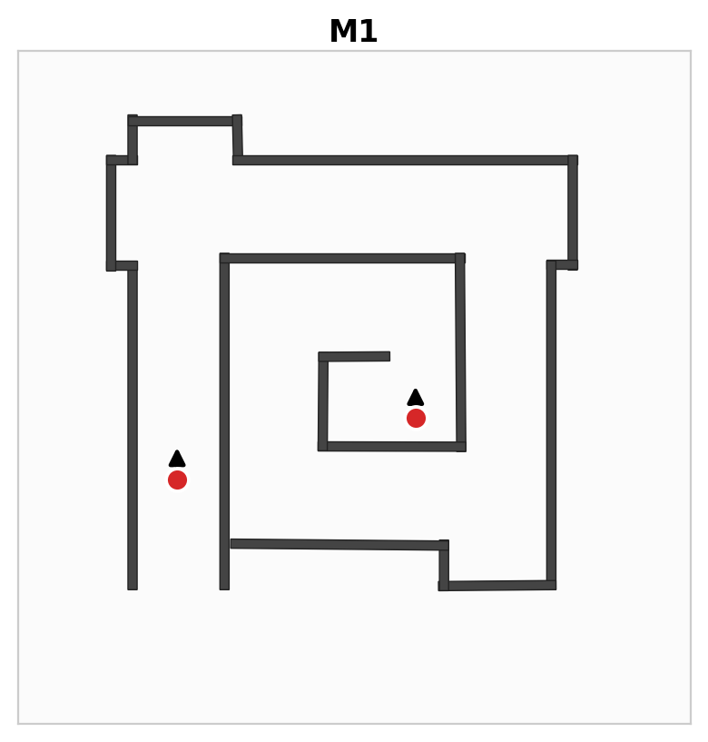
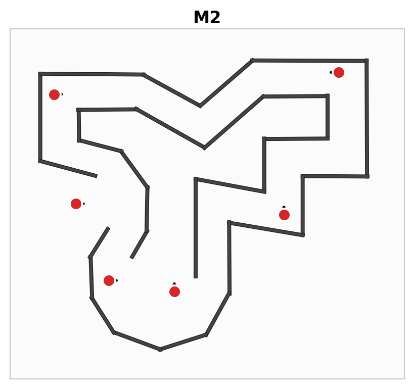
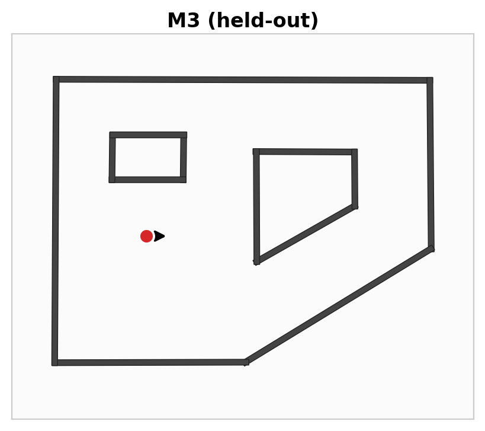
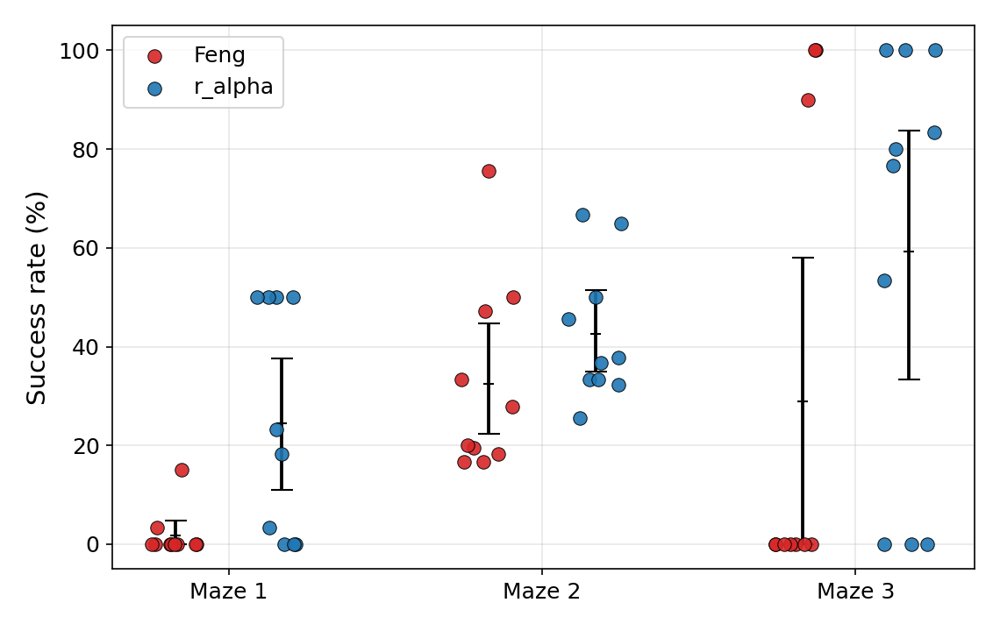
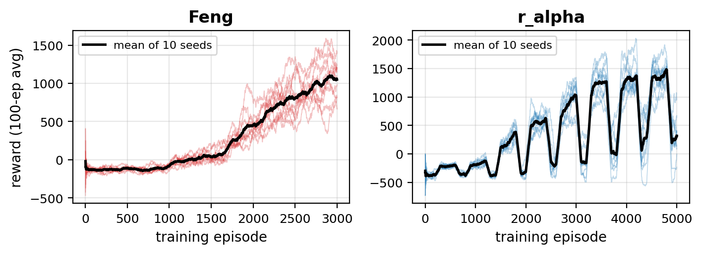
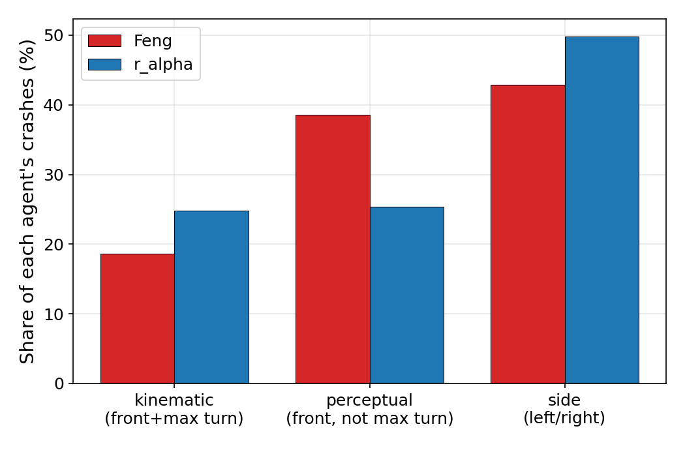

# Feng vs r_alpha — recap per il gruppo (per il VIDEO)

**Data:** 1 giugno 2026 · **Autori:** Bolognini, Covolo, D'Antona, Masciavè
**A cosa serve:** allineare tutti sui numeri e sulla storia **finali (N=10)** prima di girare il video. I dettagli "da paper" stanno nel `main.tex` (versione IEEE, su Overleaf).

> ⚠️ **Novità rispetto alla versione 27/05:** ora siamo a **10 seed** (non 5). Diversi numeri sono cambiati e una conclusione si è **ribaltata** (vedi M2). Usate SOLO i numeri di questo file per il video.

---

## TL;DR (leggi almeno questo)

- Confrontiamo **due agenti**: la **riproduzione fedele di Feng** (reward semplice, allenato solo su M2) e la **nostra variante r_alpha** (reward arricchito, allenata su M1+M2).
- Valutazione seria: **10 seed** ciascuno, test greedy (ε=0), riportiamo **distribuzioni** (mean, IQM, intervalli di confidenza, probability of improvement), **mai la run migliore**.
- Storia in una riga: *con una valutazione onesta, la riproduzione fedele di Feng **non generalizza in modo affidabile** a un maze mai visto, e una metrica "miglior run" lo nasconderebbe. La nostra r_alpha **migliora**, ma resta un pacchetto, non una bacchetta magica.*
- **Confronti equi solo su M2 e M3** (vedi sotto). **M1 NON è un confronto giusto.**

---

## 1. Cosa confrontiamo

| | **Feng (fedele)** | **r_alpha (nostro)** |
|---|---|---|
| Reward | +5 per passo, −1000 collisione | arricchito: `5 + 2·spazio − sterzata − pericolo` |
| Stato | 50 bin LiDAR grezzi (dim 50) | 50 bin min-pool ×3 frame + heading (dim **152**) |
| Augment. | nessuna | rumore LiDAR (domain randomization, σ=0.02) |
| Training | **solo M2**, 3000 episodi | **M1+M2**, 5000 episodi |

r_alpha cambia **7 cose insieme** (+ più episodi = l'8ª). Quindi NON è un'ablazione: diciamo "il pacchetto r_alpha è meglio", **mai** "è merito del reward shaping".

I 3 maze: **M1** e **M2** = training (M1 **solo** per r_alpha); **M3 = mai visto da nessuno** → test di generalizzazione zero-shot.

  
*M1, M2 (training) e M3 (held-out). Pallini rossi = spawn di valutazione con orientamento iniziale.*

---

## 2. Numeri chiave (success rate %, 10 seed, Machine A)

| Maze | Feng | r_alpha | Confronto |
|---|---|---|---|
| **M1** | 1.8 (IQM 0) | 24.5 (IQM 24) | ⚠️ **NON equo** — Feng non ha mai visto M1 in training |
| **M2** | 32.5 (IQM 28) | 42.6 (IQM 39) | ✅ equo (training ~uguale) → r_alpha **meglio** (PoI **0.72**), ma CI ancora sovrapposti |
| **M3** *(mai visto)* | 29 — **3/10 risolvono** | 59 — **7/10 risolvono** | ✅ equo (zero-shot per entrambi) → r_alpha meglio, ma **bimodale** |

- **Ribaltamento vs N=5:** su M2 a 5 seed sembrava "testa o croce" (PoI 0.54). A **10 seed** r_alpha è **meglio** (PoI 0.72). Questo è cambiato — usate 0.72.
- **M3 è bimodale:** ogni seed o risolve (~100%) o fa 0%. La **media inganna** (non descrive nessuna run). Per questo su M3 riportiamo **quanti seed risolvono** (3/10 vs 7/10), non l'IQM.
- PoI aggregata: **0.73**.

*Ogni pallino = un seed. M3 chiaramente bimodale: o 0% o ~100%.*

---

## 3. Tre cose che abbiamo imparato

**(a) La varianza tra seed è enorme; M3 è una lotteria.** Su M3 i seed o risolvono o falliscono. La media (29% / 59%) descrive "quanti seed sono stati fortunati", non una policy tipica. → riportiamo distribuzione + frazione di seed che risolvono.

**(b) Il reward di training NON predice la generalizzazione.** Esempio (r_alpha): il seed con il reward di training **più basso** (−233) fa **77% su M3**; un seed con reward molto più alto (384) fa **0% su M3**. Correlazione (Spearman) reward-training vs successo-M3 = **−0.14** (≈0), contro **+0.58** su M2 (in-distribution). Morale: guardare la curva di training per dire "modello buono" è fuorviante — è il cuore della critica alla metrica single-run di Feng.

*10 seed (linee tenui) + media (nera). Feng sale liscio e i seed divergono tardi. r_alpha oscilla: scende sui blocchi M1 (fallisce lo spawn centrale di M1) e risale su M2.*

**(c) Cambiare macchina rompe tutto.** Stesso codice, stessi 5 seed condivisi, su una seconda macchina (B): su M3 il successo **crolla a ~0%**, M2 regge. Il timing di Gazebo è una variabile nascosta. **Non si uniscono i seed di macchine diverse.** Nel report è un *limite/threat to validity*, non un contributo — ma per il video è un effetto-wow.

---

## 4. Perché crashano (versione CORRETTA — diversa dal 27/05)

Abbiamo guardato **come** crashano, non solo quanto. Distribuzione dei crash (% per agente):

- **La maggior parte dei crash NON è un limite fisico.** Il gruppo più grande sono i **side crash** (~43% Feng, ~50% r_alpha: striscia il muro girando) e i **frontali non-cinematici** (va praticamente **dritto contro il muro pur avendo spazio** per evitarlo). Causa = **percettiva**: il reward non dice *da che parte* girare e la rete è quasi indifferente tra le azioni (valore dell'azione scelta solo ~6–12% sopra le altre).
- **Alcuni spawn portano in vicoli ciechi**, messi **apposta in fase di design** per stressare il robot.
- **Solo una minoranza (~19% Feng, ~25% r_alpha) è davvero cinematica:** sterza al massimo ma la curva è più stretta del raggio minimo `R_min = v/ω_max = 0.5/0.8 = 0.625 m` → fisicamente impossibile a velocità fissa. **Questo è secondario, non la storia principale.**
- Collegamento col training: l'oscillazione di r_alpha è perché fallisce ripetutamente **lo spawn centrale di M1** — ma lì **il robot ci potrebbe girare**, quindi è percettivo, non meccanico.

> 🎬 **Per il video, NON dire** "Feng fallisce per un limite cinematico". Di': "la maggior parte dei crash è percettiva (va dritto nel muro); solo una minoranza è un limite fisico di sterzata".

---

## 5. 🎬 Talking points per il VIDEO

**DA DIRE (storia onesta):**
- Headline: *"non fidarti della miglior run"* — con valutazione multi-seed seria, una riproduzione fedele di Feng non generalizza in modo affidabile.
- M2 = confronto equo → r_alpha **modestamente meglio** (PoI 0.72).
- M3 = held-out, lotteria bimodale → r_alpha lo risolve in **7/10 seed contro 3/10** di Feng.
- Cross-hardware: stesso codice, altra macchina, M3 crolla a ~0% (effetto forte da mostrare).
- Crash = soprattutto percettivi + qualche vicolo cieco di design; il limite cinematico (0.625 m) è minoritario.
- Lavoro futuro: velocità riducibile (es. 22 azioni: 11 sterzate × {0.25, 0.5} m/s) per il pezzo cinematico; reward direzionale per il percettivo.

**DA NON DIRE (trappole):**
- ❌ "Abbiamo battuto Feng." (è un miglioramento modesto e bundle, non netto)
- ❌ Usare **M1** come prova → Feng non l'ha mai visto in training, confronto sleale.
- ❌ Mostrare/citare la **media** di M3 come se fosse rappresentativa (è bimodale).
- ❌ "Il merito è del reward shaping" → cambiamo 7 cose insieme, non possiamo attribuirlo.
- ❌ Unire i risultati delle due macchine.

---

## 6. Cosa NON possiamo dire (onestà = punto di forza)

- **Non** è un confronto pulito fattore-per-fattore: r_alpha cambia 7 cose + più episodi → "il pacchetto è meglio".
- **N=10** è ancora modesto: diversi CI si sovrappongono → alcuni confronti restano **inconcludenti**, e va detto.
- "Success" = **sopravvivere 500 passi senza schiantarsi** (è la natura del collision avoidance: non c'è un goal da raggiungere).

---

*Numeri completi: `ANALISI_TRAINING/2026_06_01/aggregate_r_alpha_hw_A_N10.csv` (+ feng in `2026_05_29/`). Script figure: `make_figures_report.py`, `make_maze_figs.py`, `make_training_curves.py`, `analyze_extra.py`. Report IEEE (EN) su Overleaf, 3 pagine.*
