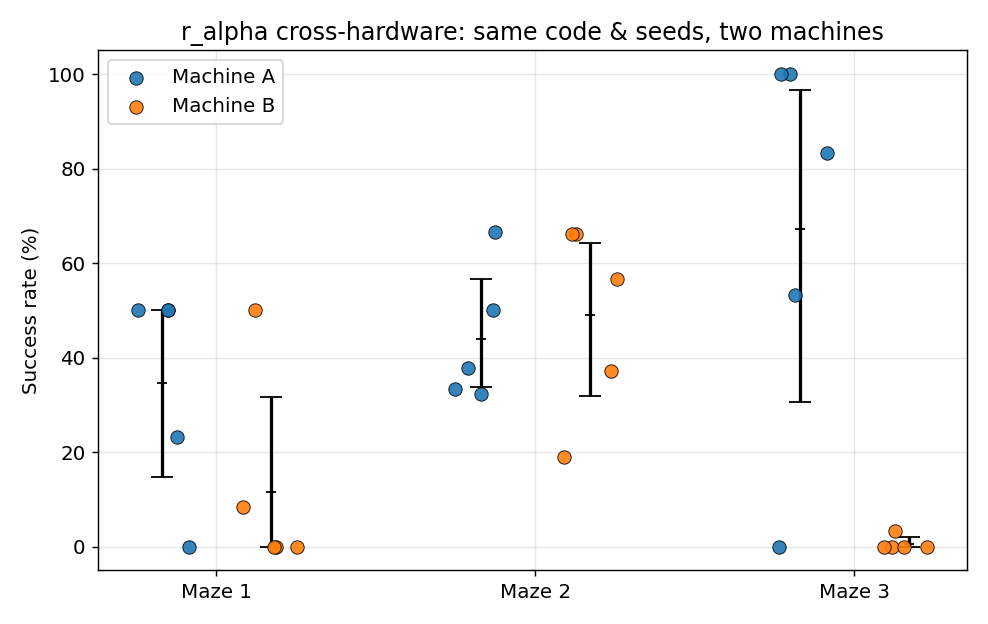

# Feng vs r_alpha — recap per il gruppo

**Data:** 27 maggio 2026
**Autori:** Bolognini, Covolo, D'Antona, Masciavè
**A cosa serve questo file:** spiegare in modo semplice cosa è uscito dagli esperimenti e cosa proponiamo di scrivere nel report. Niente formalismi: i dettagli "da paper" stanno nella versione inglese.

---

## TL;DR (leggi almeno questo)

- Abbiamo confrontato **due agenti** sullo stesso problema: la **riproduzione fedele di Feng** (reward semplice, allenato solo su M2) e la **nostra versione r_alpha** (reward più ricco, allenata su M1+M2).
- Entrambi sono stati valutati **sul serio**: 5 seed ciascuno, test greedy (ε=0), e riportiamo **distribuzioni** (mean, IQM, intervallo di confidenza), **mai la run migliore**.
- Risultato onesto: **r_alpha è un po' meglio, ma non in modo netto.** Sul maze che entrambi hanno visto in training (M2) sono **pari**. Sul maze mai visto (M3) entrambi sono **a lotteria**: alcuni seed lo risolvono, altri fanno 0%.
- Bonus pesante: lo **stesso codice, stessi seed, su una macchina diversa (MSI)** dà risultati molto diversi — su M3 si passa da ~67% a **~0%**. La riproducibilità è fragile, e questo è uno dei nostri risultati più forti.

---

## 1. Cosa abbiamo confrontato

| | **Feng (fedele)** | **r_alpha (nostro)** |
|---|---|---|
| Reward | solo +5 per passo, −1000 collisione | reward arricchito (bonus spazio, penalità sterzata, ecc.) |
| Training | solo Maze 2, 3000 episodi | Maze 1 + Maze 2, 5000 episodi |
| Stato | 50 bin LiDAR grezzi | 50 bin × 3 frame + heading |

Importante: per il confronto **feng vs r_alpha usiamo la stessa macchina** (Machine A). Così la differenza non è "colpa" dell'hardware. La seconda macchina (B) la usiamo **solo** per mostrare il problema di riproducibilità.

I 3 maze: **M1** e **M2** servono al training (M1 solo per r_alpha), **M3 non è mai visto da nessuno** → è il test di generalizzazione.

---

## 2. Numeri chiave (success rate, %)

| Maze | Feng (A) | r_alpha (A) | r_alpha (B, MSI) |
|---|---|---|---|
| M1 | 3 (IQM 0) | 35 (IQM 41) | 12 |
| M2 | 41 (IQM 38) | 44 (IQM 40) | 49 |
| M3 *(mai visto)* | 38 ± 52 (IQM 30) | 67 ± 42 (IQM 79) | **0.7** |

- Su **M1**: r_alpha vince, ma **non è un confronto giusto** — Feng non ha mai visto M1 in training.
- Su **M2** (entrambi allenati): **sostanzialmente pari** (la probabilità che r_alpha superi Feng è 0.54, cioè testa o croce).
- Su **M3**: r_alpha ha numeri migliori, ma con varianza enorme e tanti zeri. Nessuno dei due "generalizza" in modo affidabile.

*Ogni pallino = un seed. Si vede subito che M3 è bimodale: o 0% o ~100%, niente in mezzo.*

---

## 3. Tre cose che abbiamo imparato

**(a) La varianza tra seed è enorme, e M3 è una lotteria.**
Su M3 i seed o risolvono (≈100%) o falliscono (0%). La media (38% o 67%) **non descrive nessuna run reale**: descrive "quanti seed hanno avuto fortuna". Per questo riportiamo IQM e intervalli di confidenza, non un numero secco.

**(b) Il reward di training NON dice se l'agente generalizza.**
Esempio concreto (r_alpha): il seed con il **2° miglior reward di training** (s2) fa **0% su M3**. Il seed con il reward di training **peggiore** (s3, praticamente zero) fa **53% su M3**. La correlazione tra "reward a fine training" e "successo su M3" è **circa zero** (−0.1). Morale: guardare la curva di training per dire "il modello è buono" è fuorviante. Questo è il cuore della nostra critica alla metrica di Feng (che riporta la singola run migliore).

**(c) Cambiare macchina rompe tutto.**
Stesso codice, stessi seed, altra macchina (MSI): su M3 si passa da ~67% a ~0%, su M1 da 35% a 12%. M2 regge. L'hardware (timing di Gazebo) è una variabile nascosta. **Non possiamo unire i seed delle due macchine** come se fossero un unico esperimento: sono due popolazioni diverse.

---

## 4. Perché Feng fatica (in parole povere)

Abbiamo guardato **come** crasha, non solo quanto. Due cause distinte (dai dati, non a sensazione):

- **Limite cinematico (fisica, non apprendimento).** Il robot va sempre a 0.5 m/s e può girare al massimo a 0.8 rad/s → raggio di sterzata minimo **0.625 m**. In curve strette **non riesce fisicamente a girare**, sterza al massimo e va a sbattere davanti. Nei dati: ~24% di tutti i crash hanno questa firma (azione di sterzo estrema + collisione frontale). Nessun reward può sistemarlo: serve poter **rallentare**.
- **Problema percettivo/reward.** Tanti crash sono invece "va dritto nel muro" pur avendo spazio per girare: il reward non gli dice *da che parte* andare, e la rete MLP è "cieca" alla struttura spaziale (sceglie le azioni quasi a caso — la differenza di valore tra azioni è solo il ~6–12% del valore).

---

## 5. Cosa proponiamo per il report

- Raccontare la storia **metodologica**, non "abbiamo battuto Feng": *con una valutazione seria, una riproduzione fedele di Feng non generalizza in modo affidabile, e una metrica "single best run" lo nasconderebbe*.
- Mostrare r_alpha come **miglioramento onesto** (sposta i numeri su, non risolve la lotteria).
- Proporre come **lavoro futuro** una variante con velocità riducibile (es. 22 azioni: 11 sterzate × {0.25, 0.5} m/s) per attaccare il limite cinematico. Eventualmente un breve video dimostrativo, **senza** spacciarlo per risultato statistico.

---

## 6. Cosa NON possiamo dire (onestà = punto di forza)

- **Non** è un confronto pulito fattore-per-fattore: r_alpha cambia ~7 cose insieme + più episodi. Quindi diciamo "il pacchetto r_alpha è meglio", non "è merito del reward shaping".
- **n=5** è poco: molti intervalli di confidenza si sovrappongono → diversi confronti sono **inconcludenti**, e va detto.
- "Success" qui = **sopravvivere 500 passi senza schiantarsi**, non *raggiungere un obiettivo*. Quindi "generalizza a M3" significa "sopravvive in M3", non "naviga verso la meta".

---

*Per i numeri completi: `ANALISI_TRAINING/2026_05_27/aggregate_*.csv`. Script: `analyze_extra.py`, `make_figures_report.py`. Versione paper (EN, IEEE) in preparazione.*
